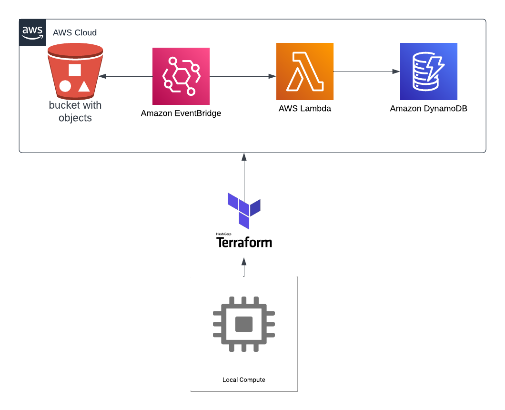

<h1 align="center">

<h3> 
 MARVEL DATA ENGINEER 
 </h3>
<h3> 
 ================= 
 </h3>

>> <h3> Solution Architecture </h3>

>> <h3> Glossary of Data </h3>

Fields	                                                  | Type  	  |    Description                              |
----------------------------------------------------------|:---------:|:-------------------------------------------:|
id_                                         						  |string 	  | id of the characters                        |             
name                                         						  |string 	  | name of the characters                      |   
description                                        				|string 	  | description of the characters               |
image                                             				|string 	  | url with image of the characters            |     

>> <h3> Description </h3>

 This is an example cloud architecture project for a data engineer. Using Marvel's api, a first scraping is done that creates a file in a local directory called "dataset". This folder is being monitored by a linux service that, when it receives a file or a file update, it triggers terraform migrating the entire service to aws.
In AWS a bucket is created, and automatically starts a lambda process that reads its contents, performs the necessary transformations and populates a dynamoDB. 

>> <h3> How to Run </h3>

To run this project you need to follow a few steps:

<ol>
  <li>Make sure you have the TerraForm installed on your machine, if you do not have it, you can install following the instructions on the official website: <a href="https://www.terraform.io/downloads.html">https://www.terraform.io/downloads.html</a></li>
  <li>Clone the project repository on your machine.</li>
  <li>Go to https://developer.marvel.com/ and click "Get a Key".</li>
  <li> Log in with your Marvel account or create a new account. </li>
  <li> Fill in the form with the requested information, such as the name of the application, the name of the developer, the email and the country. </li>
  <li> Accept the API terms and conditions and click "Create Account". </li>
  <li> After creating the account, you will be redirected to the "My Account" page and you will be able to see your public key (public key) and your private key (private key). </li>
  <li> Save these keys in your machine </li>
  <li>Access the cloned project directory and build a parameter file called param/param.json </i>
  <li> This file is a json, so build the variables that the script/insert_on_dataset.py file needs. Including the api keys. </li>
  <li> Finally, run the run.sh file with the command "sh run.sh".</li>
  and run the run.sh file with the command "sh run.sh".</li>
  <li>Open the variables.tf file and fill in all requested variables.</li>
</ol>

After following these steps, the infrastructure will be ready and its ETL may be executed.

